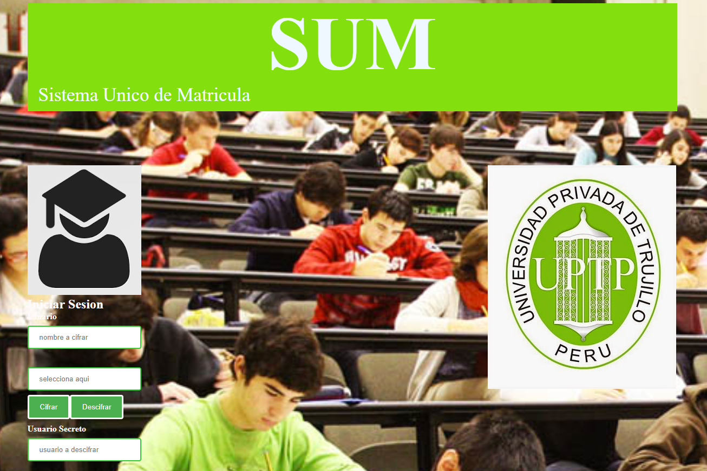

##__SISTEMA DE MATRICULA ESPECIAL__

Este programa esta realizado pensando en la necesidad de un grupo de jovenes estudiantes de una institucion que desean matricularse en los cursos de su eleccion sin revelar su identidad, encriptando a traves del **metodo 'codigo cesar'**, sus nombres por uno de **'usuario privado'** ya que no desean que su matricula y eleccion de cursos sea publica para todo el cuerpo estudiantil.

__Para aplicarlo__ solo se debe acceder a la pagina de matricula y en la pantalla de acceso: ingresar tu nombre, seleccionar el numero del desplazamiento que se desea para generar tu codigo y seleccionar el boton encriptar para ver el nuevo nombre de usuario y desencriptar para revelarlo.

__la finalidad__ del producto es resolver este problema, dandole **seguridad y confianza** al usuario para mantener su nombre en reserva, sus datos personales, su identidad, su eleccion de curso y las veces que desee llevarlo haciendo que los demas estudiantes no logren identificarse entre si, sabiendo que unicamente cada uno de ellos posee su propio codigo q revelara su identidad.

### Decisiones de diseño
El diseño de la pagina fue pensado en un color que sea jovial y que brinde energia y confianza, mi eleccion fue el verde limon,se penso en una pagina sencilla y de facil acceso haciendo que la funcion se ubique en la pagina principal haciendo que el usuario no se aburra al momento de ingresar los datos, encriptar y desencriptarlos y que todo abarque en una misma pagina, para mi diseño coloque como imagen de fondo un grupo de estudiantes en clase y el logotipo de una institucion, este logo puede variar dependiendo del centro educativo.